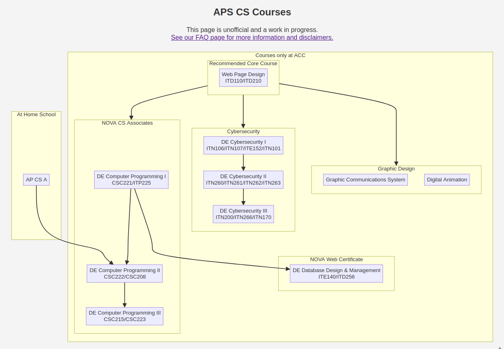

# Intro / Summary

Hi! These are the notes from our presentation. Boxes like the below match the 
slides we're presenting, and notes like this do not appear in the slides but
will contain extra notes, references, links.

We generate the slides and these notes from a single Markdown document, using the
magic of Pandoc with Lua filters. To peek behind the curtain, here's our repo:
<https://github.com/cj0ne5/pandoc-lecturenotes>

::: {.slide .presentation}
# Intro / Summary
:::

::: slide
## Intro / Summary
- Dual Enrolled CS / IT Classes in Arlington, VA
- Our school has a unique student body, including full- and part-time students
- We're developing an integrated CS pathway
- Project-based learning:
    - Real projects, real customers
    - Collaboration with professional developers around the world

:::

::: slide
## Radical Transparency

You can find everything we do on our website:

<https://ict.gracehopper.center>

On our homepage, a link to these slides, and an accompanying PDF that has
additional notes, links, and examples.
:::

# CS @ The Grace Hopper Center

::: {.slide .presentation}
# CS @ The Grace Hopper Center
:::

::: slide
## Dual Enrollment

- Our students:
    - Earn normal high school credits
    - Sit for industry certification tests (82 certifications so far this year, and counting!)
    - Earn 6 college credits per year-long class
    - Connect with resources and faculty at NOVA
    - Graduate high school with an A.S. in CS 
:::

::: slide
## Our DE Program Has Some Unique Differences

- Cohort model - we have the same students all four years
- Mixing CS/IT Courses
    - Thanks to NOVA for working with us on prerequisite requirements
- Backwards Design
    - At the end of second year, students have a portfolio demonstrating
    full-stack web development experience
    - And are prepared to continue to a four-year universty
:::

::: slide
## Integrated Pathway

- Tightly-coupled courses
- Strict pre-requisites
- Emphasis on full-stack web development
- Online portfolio maintained throughout the pathway
:::

Some example student portfolios:

- <https://1bmedina.github.io/>
- <https://github.com/Archonic944>
- <https://github.com/BlueZeeKing>

::: slide
## Our Courses

:::

Full, interactive version is available here: <https://apscs.org/index.html?school=acc>.

# OER @ GHC

::: {.slide .presentation}
# OER @ GHC
:::

::: slide
## Teaching without OER - a parable

- My first year as a CS teacher, a colleague showed me an exciting online learning
/ coding sandbox. Together we convinced our school system to
buy expensive licenses, and I spent a ton of time building lessons and coding
problems on the site
- When we shared this story with a colleague, they wrote back with some questions:
    + "When we write material, who owns it? If we end contract in 2 years (or they go belly up), do I still have all of my questions, and in a usable form?"
    + "If I keep my materials on {platform}, what happens when I want to share or give to students that are not subscribed? Will my NVCC students not be able to use those materials?"
- At the end of that school year, the system was acquired and closed down. All 
my materials were lost :/
- Our school system moved to another big name online CS curriculum vendor and
 spends >$2000 **per section** for access
- It's a good system, but I don't love the way some of the lessons were presented, 
and had no ability to create my own exercises, re-mix materials, etc
- Occasional payment glitches leave us locked out with nothing
:::

::: slide
## OER

- Everything we do is based on OER resources that we either find or create
- Class websites <ict.gracehopper.center> licensed under CC BY-SA 4.0
- Textbooks released via <https://openbookproject.net/>
:::

Here are a few OER resources made by others that we use in classes:
- <https://www.dj4e.com/>
- <https://discrete.openmathbooks.org/dmoi4.html>

::: slide
## Open Source Software

- Strong emphasis on low-level, open source software for all of our in-class exercises
- 9th graders spend a lot of time learning unix command line, git, vim.
:::

::: slide
## OER - Student Contributions

- Students are part of the system!
- All of our work is contained in public git repos, 
students are invited to contribute
- Students select licenses for each repo they create
- Student project work becomes part of future classes
:::

Can we add some examples here of student projects we've incorporated into our classes?

# Project Based Learning (PBL)

::: {.slide .presentation}
# Project Based Learning (PBL)
:::

::: slide
## PBL - In Theory

- We love it!
- Dogfooding - develop projects that help our own communities
- Technical and durable skills develop together
:::
 
::: slide
## PBL - In Practice 

- A few recent projects:
    - Arlington 2050 Survey Data Analysis
    - Nova Web Development, Jetro Web Development, Worker Co-ops
    - Django Reservation Systems
        - <https://culinary.gracehopper.center>
        - <https://cosmetology.gracehopper.center>
:::

# Questions / Contacts

::: slide
## Questions / Contacts

Thanks!

- Chris Jones: cmj2310@email.vccs.edu
- Jeff Elkner: jde232@email.vccs.edu
- <https://ict.gracehopper.center>

:::
